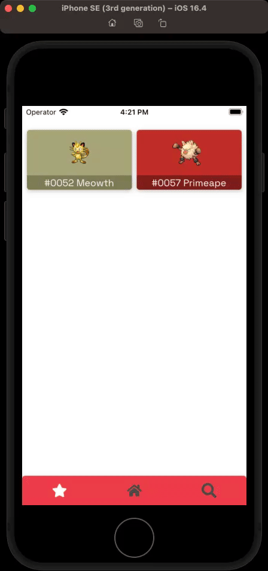
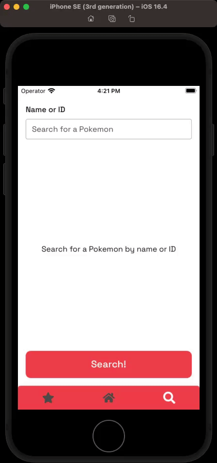

# React Native Pokedex

A small app written in React Native that uses the PokeApi to display information about Pokemon.

## Introduction

This project is a simple React Native app that allows users to browse a list of Pokemon, view their details, and search for specific Pokemon. The app is built using modern technologies and is designed to be fast, responsive, and easy to use.

## Features

- Scroll through a list of all Pokemon
- Press on a Pokemon to view its details
- Favorite a Pokemon
- View their favorite Pokemon
- Search for a Pokemon

## Getting Started

To run the project locally, follow these steps:

1. Clone the repository to your local machine
2. Install the dependencies using `yarn`
3. Start the Metro serve using `yarn start`
4. Open the app in iOS or Android using `yarn ios` or `yarn android`

## Demo

Home Screen and Pokemon Details Screen

Favorites Screen

Search Screen

## Tech Stack

- React-Native
- Ignite
- MobX State Tree
- apisauce
- i18n-js

## Architecture and Design

The project is designed using a simple, modular architecture that separates concerns and promotes reusability. The app uses modern React features like hooks and MobX State Tree to manage state.
